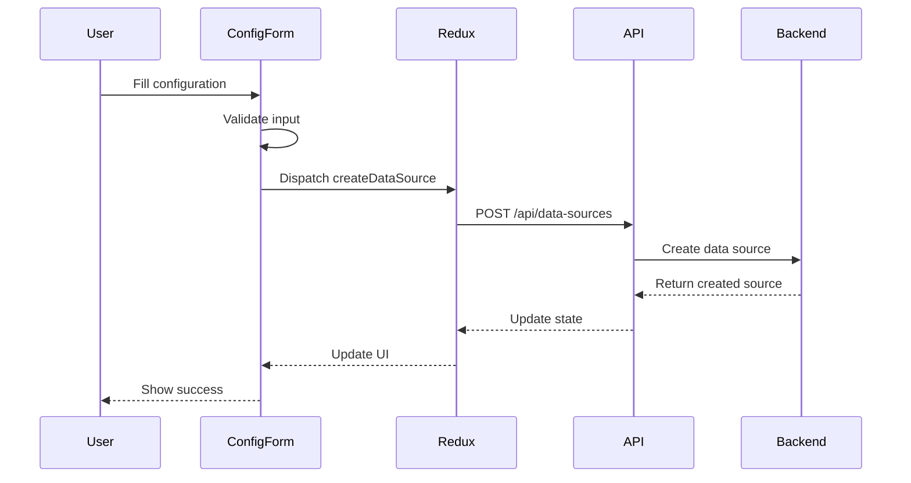
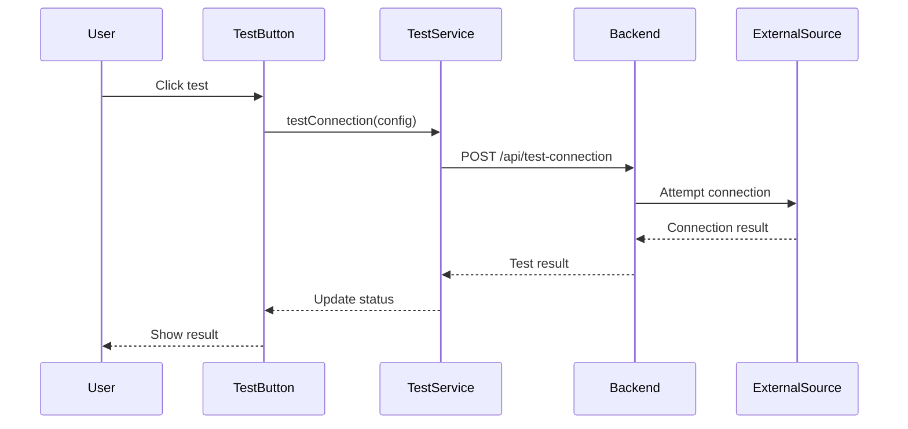
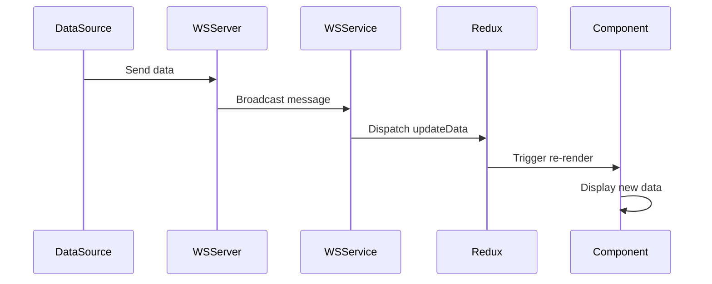

# Data Flow Architecture

## Overview

This document describes how data flows through the Data Source Configuration Manager application.

## Data Flow Patterns

### 1. Configuration Creation Flow



### 2. Connection Testing Flow



### 3. Real-time Data Flow (WebSocket)



## State Management Patterns

### Redux State Shape

```typescript
interface AppState {
  auth: {
    user: User | null;
    token: string | null;
    isAuthenticated: boolean;
  };
  dataSources: {
    items: DataSource[];
    loading: boolean;
    error: string | null;
    selectedId: string | null;
  };
  ui: {
    modals: {
      [key: string]: boolean;
    };
    notifications: Notification[];
    theme: 'light' | 'dark';
  };
  realtime: {
    connections: {
      [sourceId: string]: ConnectionStatus;
    };
    data: {
      [sourceId: string]: any[];
    };
  };
}
```

### Action Patterns

```typescript
// Async actions follow Redux Toolkit pattern
export const fetchDataSources = createAsyncThunk(
  'dataSources/fetch',
  async () => {
    const response = await api.getDataSources();
    return response.data;
  }
);

// Sync actions for UI updates
export const toggleModal = createAction<string>('ui/toggleModal');
```

## Data Transformation Pipeline

### 1. Input Validation

```typescript
// Form validation schema
const dataSourceSchema = yup.object({
  name: yup.string().required().min(3).max(50),
  protocol: yup.string().oneOf(['http', 'websocket', 'grpc', 'queue']),
  connectionDetails: yup.object().when('protocol', {
    is: 'http',
    then: yup.object({
      url: yup.string().url().required(),
      method: yup.string().oneOf(['GET', 'POST', 'PUT', 'DELETE']),
      headers: yup.object()
    })
  })
});
```

### 2. Request Transformation

```typescript
// API request interceptor
api.interceptors.request.use((config) => {
  // Add auth token
  config.headers.Authorization = `Bearer ${getToken()}`;
  
  // Transform data format
  if (config.data) {
    config.data = transformRequestData(config.data);
  }
  
  return config;
});
```

### 3. Response Transformation

```typescript
// API response interceptor
api.interceptors.response.use(
  (response) => {
    // Transform response data
    return {
      ...response,
      data: transformResponseData(response.data)
    };
  },
  (error) => {
    // Handle and transform errors
    return Promise.reject(transformError(error));
  }
);
```

## Caching Strategy

### Client-Side Caching

```typescript
// React Query for server state
const useDataSources = () => {
  return useQuery({
    queryKey: ['dataSources'],
    queryFn: fetchDataSources,
    staleTime: 5 * 60 * 1000, // 5 minutes
    cacheTime: 10 * 60 * 1000, // 10 minutes
  });
};
```

### Redux Persistence

```typescript
// Persist specific slices
const persistConfig = {
  key: 'root',
  storage,
  whitelist: ['auth', 'ui'],
  blacklist: ['realtime']
};
```

## Error Handling Flow

### Error Boundaries

```typescript
class DataSourceErrorBoundary extends ErrorBoundary {
  handleError(error: Error) {
    // Log to monitoring service
    logger.error('DataSource Error', error);
    
    // Update Redux state
    store.dispatch(setError(error.message));
    
    // Show user notification
    store.dispatch(showNotification({
      type: 'error',
      message: 'Failed to load data source'
    }));
  }
}
```

### Retry Logic

```typescript
const retryableRequest = async (
  request: () => Promise<any>,
  maxRetries = 3,
  delay = 1000
) => {
  for (let i = 0; i < maxRetries; i++) {
    try {
      return await request();
    } catch (error) {
      if (i === maxRetries - 1) throw error;
      await sleep(delay * Math.pow(2, i)); // Exponential backoff
    }
  }
};
```

## Performance Optimizations

### Debouncing

```typescript
// Debounce search input
const debouncedSearch = useMemo(
  () => debounce((query: string) => {
    dispatch(searchDataSources(query));
  }, 300),
  [dispatch]
);
```

### Memoization

```typescript
// Memoize expensive computations
const processedData = useMemo(() => {
  return expensiveDataProcessing(rawData);
}, [rawData]);
```

### Virtualization

```typescript
// Virtual scrolling for large lists
<VirtualList
  height={600}
  itemCount={dataSources.length}
  itemSize={80}
  renderItem={({ index, style }) => (
    <DataSourceItem
      style={style}
      dataSource={dataSources[index]}
    />
  )}
/>
```

## Security Considerations

### Data Sanitization

```typescript
// Sanitize user input
const sanitizeConfig = (config: any) => {
  return {
    ...config,
    name: DOMPurify.sanitize(config.name),
    connectionDetails: sanitizeConnectionDetails(config.connectionDetails)
  };
};
```

### Sensitive Data Handling

```typescript
// Never log sensitive data
const logSafeConfig = (config: DataSourceConfig) => {
  const { password, apiKey, ...safeConfig } = config.connectionDetails;
  return {
    ...config,
    connectionDetails: safeConfig
  };
};
```