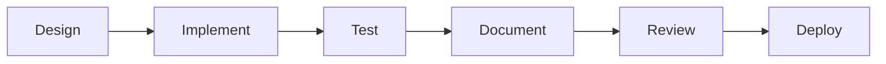

# Component Documentation

This directory contains detailed documentation for all React components in the Data Source Configuration Manager.

## Component Categories

### 1. Common Components
Reusable UI components used throughout the application.

- [Button](./common/Button.md) - Customizable button component
- [Input](./common/Input.md) - Form input with validation
- [Select](./common/Select.md) - Dropdown selection component
- [Modal](./common/Modal.md) - Modal dialog component
- [Alert](./common/Alert.md) - Notification alerts

### 2. Data Source Components
Components specific to data source configuration.

- [ConfigurationForm](./data-sources/ConfigurationForm.md) - Main configuration form
- [ConnectionTester](./data-sources/ConnectionTester.md) - Connection testing UI
- [ProtocolSelector](./data-sources/ProtocolSelector.md) - Protocol selection
- [DataSourceList](./data-sources/DataSourceList.md) - List view of sources
- [DataSourceCard](./data-sources/DataSourceCard.md) - Individual source card

### 3. Feature Components
Feature-specific components.

- [ImportExport](./features/ImportExport.md) - Bulk operations
- [QuickConnect](./features/QuickConnect.md) - Quick connection templates
- [DataVisualizer](./features/DataVisualizer.md) - Data visualization

### 4. Settings Components
Settings and configuration components.

- [ThemeToggle](./settings/ThemeToggle.md) - Dark/light mode toggle
- [PreferencesForm](./settings/PreferencesForm.md) - User preferences
- [SecuritySettings](./settings/SecuritySettings.md) - Security options

### 5. Visualization Components
Data visualization and monitoring.

- [ConnectionStatus](./visualizations/ConnectionStatus.md) - Connection indicators
- [DataChart](./visualizations/DataChart.md) - Data charts
- [MetricsDashboard](./visualizations/MetricsDashboard.md) - Metrics display

## Component Standards

### Component Structure

```typescript
// Standard component structure
import React from 'react';
import { ComponentProps } from './types';
import { useComponentLogic } from './hooks';
import styles from './Component.module.css';

export const Component: React.FC<ComponentProps> = ({
  prop1,
  prop2,
  ...rest
}) => {
  const { state, handlers } = useComponentLogic(prop1);
  
  return (
    <div className={styles.container} {...rest}>
      {/* Component content */}
    </div>
  );
};

Component.displayName = 'Component';
```

### Props Documentation

All components should have well-documented props:

```typescript
interface ComponentProps {
  /**
   * Primary action handler
   * @param value - The selected value
   */
  onChange: (value: string) => void;
  
  /**
   * Component disabled state
   * @default false
   */
  disabled?: boolean;
  
  /**
   * Additional CSS classes
   */
  className?: string;
}
```

### Component Testing

Each component should have:
1. Unit tests for logic
2. Snapshot tests for rendering
3. Integration tests for interactions

### Accessibility

All components must be accessible:
- Proper ARIA labels
- Keyboard navigation
- Screen reader support
- Color contrast compliance

## Component Development Guide

### Creating New Components

1. **Plan the Component**
   - Define clear purpose
   - Identify props interface
   - Consider reusability

2. **Implement the Component**
   - Follow project conventions
   - Add TypeScript types
   - Include documentation

3. **Test the Component**
   - Write comprehensive tests
   - Check accessibility
   - Verify performance

4. **Document the Component**
   - Create documentation file
   - Add usage examples
   - Include best practices

### Component Lifecycle



## Best Practices

### Performance
- Use React.memo for expensive components
- Implement proper key props
- Avoid inline functions in render
- Use lazy loading when appropriate

### State Management
- Keep state as local as possible
- Use context for cross-component state
- Redux for global application state
- Custom hooks for reusable logic

### Styling
- CSS Modules for component styles
- Theme variables for consistency
- Responsive design principles
- Avoid inline styles

### Error Handling
- PropTypes or TypeScript for type safety
- Error boundaries for component errors
- Graceful degradation
- User-friendly error messages

## Component API Reference

For detailed API documentation of each component, see the individual component documentation files in their respective subdirectories.